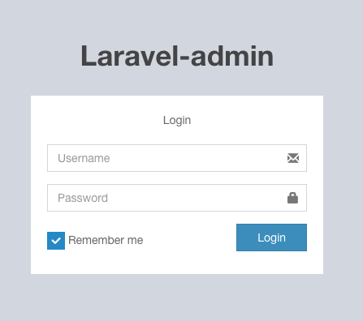

## Project settings

## Project settings
To configure this project in your local service follow the following steps:

- [Install composer](https://getcomposer.org/).
- [Install Laravel with php](https://laravel.com/).
- Create an account or if you have one, a project in [PUSHER](https://dashboard.pusher.com/), specifically create a channel.

## API-REST views for the administrator

 
-----------------------------------

-----------------------------------